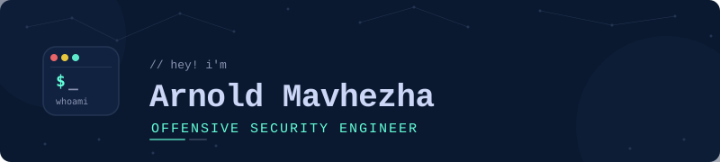

# Arnold Mavhezha — Offensive Security Engineer

  

 

---

## About

Offensive security engineer based in New York. 12 years of software development experience, 8 of them in full-stack MERN development, and 4 years of enterprise security operations, spanning API endpoint security, cloud security, and incident response.

I build things as much as I break them. See [Breach The LLM](https://github.com/breachthellm/breachthellm).

---

## Featured Project: Breach The LLM

**An open source, self-hosted AI red-teaming range.** Attack a fictional bank's fraud-review AI assistant across 7 progressively harder levels, each one a real, calibrated prompt injection technique, not a scripted demo.

- **7 levels, 7 distinct techniques**: direct injection, instruction override, indirect injection (two data sources), tool-use injection, and a hardened capstone that chains everything together
- Every level is mapped to the **OWASP LLM Top 10** and **MITRE ATLAS**, and calibrated live against a real running model (Llama 3.1 8B via Ollama), not assumed to work
- **Context Trace**: a differentiator most red-teaming tools don't have, a real-time view into exactly what the model read and trusted, system prompt, injected content, and user input, side by side
- Fully self-hosted: Docker Compose, local model inference, no data leaves your machine unless you opt into API mode
- MIT licensed, open source, free

---

## HackTheBox

### Windows

| Machine | Difficulty | Key Techniques | Write-up |
|---|---|---|---|
| **Forest** | Easy | RPC null session, AS-REP Roasting, BloodHound, WriteDACL, DCSync | [Read](https://mavhezha.com/blog/htb-forest-writeup) |
| **Sauna** | Easy | Web OSINT, AS-REP Roasting, AutoLogon, DCSync, Pass-the-Hash | [Read](https://mavhezha.com/blog/htb-sauna-writeup) |
| **Active** | Easy | GPP credentials, Kerberoasting, psexec | [Read](https://mavhezha.com/blog/htb-active-writeup) |
| **Support** | Easy | LDAP enum, .NET reverse engineering, GenericAll, RBCD | [Read](https://mavhezha.com/blog/htb-support-writeup) |
| **Timelapse** | Easy | SMB enum, PFX cert auth, PowerShell history, LAPS | [Read](https://mavhezha.com/blog/htb-timelapse-writeup) |
| **Return** | Easy | Printer credential capture, Server Operators, service binary hijack | [Read](https://mavhezha.com/blog/htb-return-writeup) |
| **Heist** | Easy | Cisco password cracking, RID brute force, Firefox memory dump | [Read](https://mavhezha.com/blog/htb-heist-writeup) |
| **Cicada** | Easy | SMB enum, RID cycling, credential reuse, SeBackupPrivilege | [Read](https://mavhezha.com/blog/htb-cicada-writeup) |
| **Access** | Easy | ACCDB credential extraction, saved RDP creds, runas SavedCreds | [Read](https://mavhezha.com/blog/htb-access-writeup) |

### Linux

| Machine | Difficulty | Key Techniques | Write-up |
|---|---|---|---|
| **Cap** | Easy | IDOR, PCAP analysis, cap_setuid privilege escalation | [Read](https://mavhezha.com/blog/htb-cap-writeup) |
| **Nibbles** | Easy | Default creds, PHP file upload, sudo misconfiguration | [Read](https://mavhezha.com/blog/htb-nibbles-writeup) |
| **Bashed** | Easy | PHP webshell, cron job privilege escalation | [Read](https://mavhezha.com/blog/htb-bashed-writeup) |
| **Shocker** | Easy | Shellshock CGI exploit, sudo perl escalation | [Read](https://mavhezha.com/blog/htb-shocker-writeup) |
| **Lame** | Easy | Samba usermap script RCE, distcc exploit | [Read](https://mavhezha.com/blog/htb-lame-writeup) |

---

## Blog

Technical write-ups at **[mavhezha.com/blog](https://mavhezha.com/blog)**

**DFIR Challenge Series** — Self-authored, 6 challenges, 29/30 flags captured:

| # | Challenge | Evidence Type |
|---|---|---|
| 01 | Log Parsing | Syslog, auth.log, Apache access logs |
| 02 | Memory Forensics | Volatility, Cobalt Strike beacon, credential extraction |
| 03 | Network Forensics | PCAP, DNS exfiltration, Wireshark |
| 04 | Disk Forensics | Ext4, deleted file recovery, artifact analysis |
| 05 | Malware Triage | PE analysis, VBA macros, YARA-style detection |
| 06 | Incident Timeline | Full breach reconstruction, MITRE ATT&CK mapping |

Completed HTB Academy's AI Red Teamer path, nine modules covering prompt injection, LLM output attacks, AI data attacks, adversarial evasion, and attacking AI applications and MCP systems.

---

## Speaking & Leadership

- **VP, ISACA Yeshiva University chapter**
- **Hack The Box Host**, Founder/Organizer, HTB New York Meetup
- **Speaker, DigiSkills 2.0 Bootcamp** (July 2026)
- **Public Relations Director, JCI Capital Zimbabwe**

---

## Certifications

---

## Tools

**Offensive**

**AI / LLM Red Teaming**

**Forensics & Detection**

**Languages & Scripting**

**Cloud & Governance**

---

## GitHub Stats

---

mavhezha.com &nbsp;|&nbsp; Reconstructing Real Attacks. Building New Ones.

